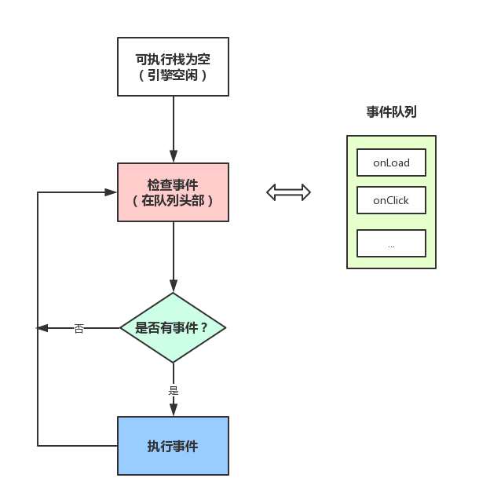
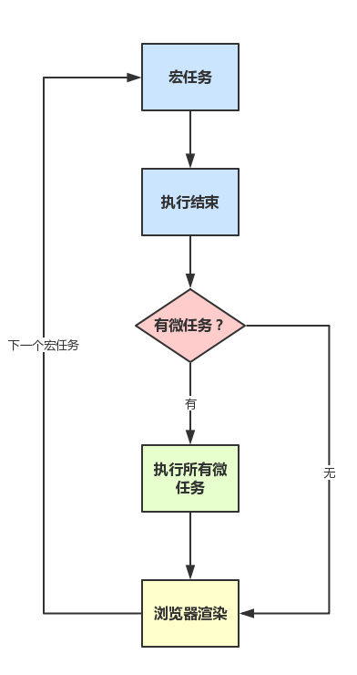

# JS引擎是单线程

- JS引擎线程
- 事件触发线程
- 定时触发器线程

- JS分为同步任务和异步任务
- 同步任务都在主线程上执行，形成一个执行栈
- 主线程之外，事件触发线程管理着一个任务队列，只要异步任务有了运行结果，就在任务队列之中放置一个事件。
- 一旦执行栈中的所有同步任务执行完毕（此时JS引擎空闲），系统就会读取任务队列，将可运行的异步任务添加到可执行栈中，开始执行。



这也就是为什么有时候setTimeout推入的事件不能准时执行？因为可能在它推入到事件列表时，主线程还不空闲，正在执行其它代码， 所以自然有误差。

# 事件循环机制进一步补充


上图大致描述就是：
- 主线程运行时会产生执行栈， 栈中的代码调用某些api时，它们会在事件队列中添加各种事件（当满足触发条件后，如ajax请求完毕）
- 而栈中的代码执行完毕，就会读取事件队列中的事件，去执行那些回调
- 如此循环
- 注意，总是要等待栈中的代码执行完毕后才会去读取事件队列中的事件

# 单独说说定时器
上述事件循环机制的核心是：JS引擎线程和事件触发线程
但事件上，里面还有一些隐藏细节，譬如调用setTimeout后，是如何等待特定时间后才添加到事件队列中的？
它是由定时器线程控制（因为JS引擎自己都忙不过来，根本无暇分身）

为什么要单独的定时器线程？因为JavaScript引擎是单线程的, 如果处于阻塞线程状态就会影响记计时的准确，因此很有必要单独开一个线程用来计时。

什么时候会用到定时器线程？当使用setTimeout或setInterval时，它需要定时器线程计时，计时完成后就会将特定的事件推入事件队列中。

```
setTimeout(function(){
    console.log('hello!');
}, 1000);
```
这段代码的作用是当1000毫秒计时完毕后（由定时器线程计时），将回调函数推入事件队列中，等待主线程执行

```
setTimeout(function(){
    console.log('hello!');
}, 0);

console.log('begin');
```
执行结果是：先begin后hello!
虽然代码的本意是0毫秒后就推入事件队列，但是W3C在HTML标准中规定，规定要求setTimeout中低于4ms的时间间隔算为4ms。 (不过也有一说是不同浏览器有不同的最小时间设定)
就算不等待4ms，就算假设0毫秒就推入事件队列，也会先执行begin（因为只有可执行栈内空了后才会主动读取事件队列）

# setTimeout而不是setInterval
用setTimeout模拟定期计时和直接用setInterval是有区别的。

因为每次setTimeout计时到后就会去执行，然后执行一段时间后才会继续setTimeout，中间就多了误差 （误差多少与代码执行时间有关）

而setInterval则是每次都精确的隔一段时间推入一个事件 （但是，事件的实际执行时间不一定就准确，还有可能是这个事件还没执行完毕，下一个事件就来了）

而且setInterval有一些比较致命的问题就是：
- 累计效应（上面提到的），如果setInterval代码在（setInterval）再次添加到队列之前还没有完成执行， 就会导致定时器代码连续运行好几次，而之间没有间隔。 就算正常间隔执行，多个setInterval的代码执行时间可能会比预期小（因为代码执行需要一定时间）
- 而且把浏览器最小化显示等操作时，setInterval并不是不执行程序， 它会把setInterval的回调函数放在队列中，等浏览器窗口再次打开时，一瞬间全部执行时

所以，鉴于这么多但问题，目前一般认为的最佳方案是：用setTimeout模拟setInterval，或者特殊场合直接用requestAnimationFrame

补充：JS高程中有提到，JS引擎会对setInterval进行优化，如果当前事件队列中有setInterval的回调，不会重复添加。不过，仍然是有很多问题。

# 事件循环进阶：macrotask与microtask
```
console.log('script start');

setTimeout(function() {
    console.log('setTimeout');
}, 0);

Promise.resolve().then(function() {
    console.log('promise1');
}).then(function() {
    console.log('promise2');
});

console.log('script end');

script start
script end
promise1
promise2
setTimeout
```
```
        setTimeout(function () {
            console.log(1)
        }, 0);
        new Promise(function executor(resolve) {
            console.log(2);
            for (var i = 0; i < 10000; i++) {
                i == 9999 && resolve();
            }
            console.log(3);
        }).then(function () {
            console.log(4);
        });
        setTimeout(function setTimeout1() {
            console.log(5)
            Promise.resolve().then(function promise2() {
                console.log(6);
            })
        }, 0)
        setTimeout(function () {
            console.log(7)
        }, 0);
        console.log(8);
        //2 3 8 4 1 5 6 7
```

macrotask（又称之为宏任务），可以理解是每次执行栈执行的代码就是一个宏任务（包括每次从事件队列中获取一个事件回调并放到执行栈中执行）
- 每一个task会从头到尾将这个任务执行完毕，不会执行其它
- 浏览器为了能够使得JS内部task与DOM任务能够有序的执行，会在一个task执行结束后，在下一个 task 执行开始前，对页面进行重新渲染 （task->渲染->task->...）

microtask（又称为微任务），可以理解是在当前 task 执行结束后立即执行的任务
- 也就是说，在当前task任务后，下一个task之前，在渲染之前
- 所以它的响应速度相比setTimeout（setTimeout是task）会更快，因为无需等渲染
也就是说，在某一个macrotask执行完后，就会将在它执行期间产生的所有microtask都执行完毕（在渲染前）

分别很么样的场景会形成macrotask和microtask呢？
- macrotask：主代码块，setTimeout，setInterval等（可以看到，事件队列中的每一个事件都是一个macrotask）
- microtask：Promise，process.nextTick等

补充：在node环境下，process.nextTick的优先级高于Promise，也就是可以简单理解为：在宏任务结束后会先执行微任务队列中的nextTickQueue部分，然后才会执行微任务中的Promise部分。

另外，setImmediate则是规定：在下一次Event Loop（宏任务）时触发（所以它是属于优先级较高的宏任务）， （Node.js文档中称，setImmediate指定的回调函数，总是排在setTimeout前面）， 所以setImmediate如果嵌套的话，是需要经过多个Loop才能完成的， 而不会像process.nextTick一样没完没了。


再根据线程来理解下：
- macrotask中的事件都是放在一个事件队列中的，而这个队列由事件触发线程维护
- microtask中的所有微任务都是添加到微任务队列（Job Queues）中，等待当前macrotask执行完毕后执行，而这个队列由JS引擎线程维护 （这点由自己理解+推测得出，因为它是在主线程下无缝执行的）

总结下运行机制：
- 执行一个宏任务（栈中没有就从事件队列中获取）
- 执行过程中如果遇到微任务，就将它添加到微任务的任务队列中
- 宏任务执行完毕后，立即执行当前微任务队列中的所有微任务（依次执行）
- 当前宏任务执行完毕，开始检查渲染，然后GUI线程接管渲染
- 渲染完毕后，JS线程继续接管，开始下一个宏任务（栈中没有就从事件队列中获取）



## 使用MutationObserver实现microtask

MutationObserver可以用来实现microtask （它属于microtask，优先级小于Promise， 一般是Promise不支持时才会这样做）

它是HTML5中的新特性，作用是：监听一个DOM变动， 当DOM对象树发生任何变动时，Mutation Observer会得到通知

像以前的Vue源码中就是利用它来模拟nextTick的， 具体原理是，创建一个TextNode并监听内容变化， 然后要nextTick的时候去改一下这个节点的文本内容
```
var counter = 1
var observer = new MutationObserver(nextTickHandler)
var textNode = document.createTextNode(String(counter))

observer.observe(textNode, {
    characterData: true
})
timerFunc = () => {
    counter = (counter + 1) % 2
    textNode.data = String(counter)
}
```


