- [1. 减少 re-render](#1-减少-re-render)
  - [1.1. shouldComponentUpdate](#11-shouldcomponentupdate)
    - [1.1.1. shallowEqual](#111-shallowequal)
  - [1.2. React.PureComponent](#12-reactpurecomponent)
  - [1.3. React.memo](#13-reactmemo)
    - [1.3.2. React.useMemo](#132-reactusememo)
- [2. 减轻渲染压力](#2-减轻渲染压力)
  - [2.4. 使用 React.Fragment 避免多层嵌套](#24-使用-reactfragment-避免多层嵌套)
  - [2.5. 减少 GPU 过度绘制](#25-减少-gpu-过度绘制)
- [3. 图片优化那些事](#3-图片优化那些事)
  - [3.6. Image 组件的优化项](#36-image-组件的优化项)
    - [3.6.3. 图片类型](#363-图片类型)
    - [3.6.4. 下载管理](#364-下载管理)
    - [3.6.5. 缓存管理](#365-缓存管理)
    - [3.6.6. 多图加载](#366-多图加载)
  - [3.7. 优先使用 32 位色彩深度的图片](#37-优先使用-32-位色彩深度的图片)
  - [3.8. Image 和 ImageView 长宽保持一致](#38-image-和-imageview-长宽保持一致)
  - [3.9. 使用 react-native-fast-image](#39-使用-react-native-fast-image)
  - [3.10. 图片服务器辅助](#310-图片服务器辅助)
    - [3.10.7. 使用 WebP](#3107-使用-webp)
    - [3.10.8. 图床定制图片](#3108-图床定制图片)
- [4. 对象创建调用分离](#4-对象创建调用分离)
  - [4.11. public class fields 语法绑定回调函数](#411-public-class-fields-语法绑定回调函数)
  - [4.12. public class fields 语法绑定渲染函数](#412-public-class-fields-语法绑定渲染函数)
  - [4.13. StyleSheet.create 替代 StyleSheet.flatten](#413-stylesheetcreate-替代-stylesheetflatten)
  - [4.14. 避免在 render 函数里创建新数组/对象](#414-避免在-render-函数里创建新数组对象)
- [5. 动画性能优化](#5-动画性能优化)
  - [5.15. 开启 useNativeDrive: true](#515-开启-usenativedrive-true)
  - [5.16. 使用 setNativeProps](#516-使用-setnativeprops)
  - [5.17. 使用 LayoutAnimation](#517-使用-layoutanimation)
  - [5.18. 使用 InteractionManager](#518-使用-interactionmanager)
  - [5.19. requestAnimationFrame：](#519-requestanimationframe)
  - [5.20. 优化View](#520-优化view)
  - [5.21. 使用 react-native-reanimated 和 react-native-gesture-handler](#521-使用-react-native-reanimated-和-react-native-gesture-handler)
  - [5.22. 使用 BindingX](#522-使用-bindingx)
- [6. 长列表性能优化](#6-长列表性能优化)
  - [6.23. 各种列表间的关系](#623-各种列表间的关系)
  - [6.24. 列表配置项](#624-列表配置项)
    - [6.24.9. initialNumToRender](#6249-initialnumtorender)
    - [6.24.10. Viewport](#62410-viewport)
    - [6.24.11. windowSize](#62411-windowsize)
    - [6.24.12. Blank areas](#62412-blank-areas)
    - [6.24.13. removeClippedSubviews](#62413-removeclippedsubviews)
    - [6.24.14. maxToRenderPerBatch 和 updateCellsBatchingPeriod](#62414-maxtorenderperbatch-和-updatecellsbatchingperiod)
  - [6.25. ListLtems 优化](#625-listltems-优化)
    - [6.25.15. 使用 getItemLayout](#62515-使用-getitemlayout)
    - [6.25.16. Use simple components & Use light components](#62516-use-simple-components--use-light-components)
    - [6.25.17. Use shouldComponentUpdate](#62517-use-shouldcomponentupdate)
    - [6.25.18. Use cached optimized images](#62518-use-cached-optimized-images)
    - [6.25.19. Use keyExtractor or key](#62519-use-keyextractor-or-key)
    - [6.25.20. Avoid anonymous function on renderItem](#62520-avoid-anonymous-function-on-renderitem)
- [7. 开发模式](#7-开发模式)
- [8. 去除console.log](#8-去除consolelog)
- [9. RAM包 和 Inline Requires](#9-ram包-和-inline-requires)
  - [9.26. RAM](#926-ram)
  - [9.27. Inline Requires](#927-inline-requires)
- [10. React Native 性能优化用到的工具](#10-react-native-性能优化用到的工具)
  - [10.28. React-Native-Debugger](#1028-react-native-debugger)
  - [10.29. React Native 官方调试工具](#1029-react-native-官方调试工具)
  - [10.30. react-devtools](#1030-react-devtools)
  - [10.31. XCode](#1031-xcode)
  - [10.32. Android Studio](#1032-android-studio)
  - [10.33. iOS Simulator](#1033-ios-simulator)
  - [10.34. Android 真机 -> 开发者选项](#1034-android-真机---开发者选项)
  - [10.35. bundle大小可视化](#1035-bundle大小可视化)
- [11. trick](#11-trick)
  - [11.36. 优化闪屏逻辑](#1136-优化闪屏逻辑)
  - [11.37. 逐层渲染](#1137-逐层渲染)
- [12. 参考](#12-参考)


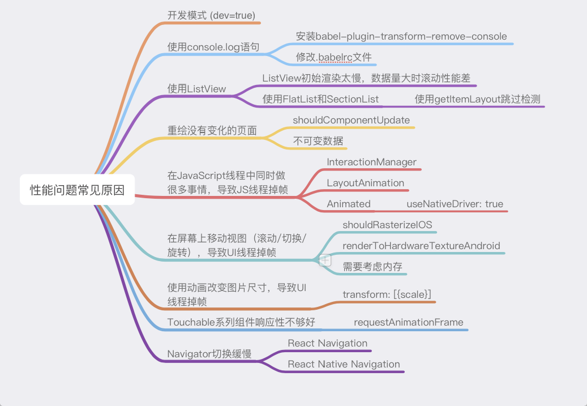
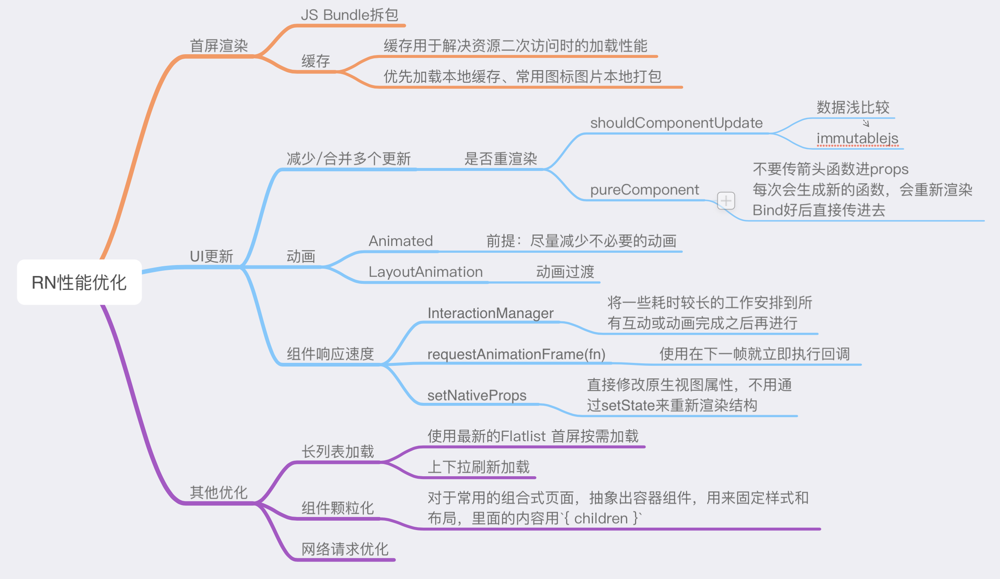


# 1. 减少 re-render
## 1.1. shouldComponentUpdate
当一个组件的 state 或者 props 改变时，就进入了生命周期函数 `shouldComponentUpdate`，而当 shouldComponentUpdate 返回的是 true ,就会调用 render 方法生成 Virtual Dom，随后和旧的 Virtual Dom 进行比对，最终决定是否更新。所以从中我们明显地看出 SCU 和 Virtual Dom 的 Diff 是影响 Dom 更新的关键所在.

### 1.1.1. shallowEqual
```js
// 用原型链的方法
const hasOwn = Object.prototype.hasOwnProperty

// 这个函数实际上是Object.is()的polyfill
function is(x, y) {
  if (x === y) {
    return x !== 0 || y !== 0 || 1 / x === 1 / y
  } else {
    return x !== x && y !== y
  }
}

export default function shallowEqual(objA, objB) {
  // 首先对基本数据类型的比较
  if (is(objA, objB)) return true
  // 由于Obejct.is()可以对基本数据类型做一个精确的比较， 所以如果不等
  // 只有一种情况是误判的，那就是object,所以在判断两个对象都不是object
  // 之后，就可以返回false了
  if (typeof objA !== 'object' || objA === null ||
      typeof objB !== 'object' || objB === null) {
    return false
  }

  // 过滤掉基本数据类型之后，就是对对象的比较了
  // 首先拿出key值，对key的长度进行对比

  const keysA = Object.keys(objA)
  const keysB = Object.keys(objB)

  // 长度不等直接返回false
  if (keysA.length !== keysB.length) return false
  // key相等的情况下，再去循环比较
  for (let i = 0; i < keysA.length; i++) {
  // key值相等的时候
  // 借用原型链上真正的 hasOwnProperty 方法，判断ObjB里面是否有A的key的key值
  // 属性的顺序不影响结果也就是{name:'daisy', age:'24'} 跟{age:'24'，name:'daisy' }是一样的
  // 最后，对对象的value进行一个基本数据类型的比较，返回结果
    if (!hasOwn.call(objB, keysA[i]) ||
        !is(objA[keysA[i]], objB[keysA[i]])) {
      return false
    }
  }

  return true
}
```

## 1.2. React.PureComponent
PureComponent实际上是对shouldComponentUpdate的封装,使用了shallowEqual,如果想深比较,一般来说是配合 immutable.js一起使用.

## 1.3. React.memo
它和 PureComponent 一样，都是进行浅比较,是一个专门针对 React 函数组件的高阶函数.

可以自定义比较过程
```
export const areEqual = (obj, newObj) => {
    if (Object.is(obj,newObj)) {
        return true;
    }
    try {
        return JSON.stringify(obj) === JSON.stringify(newObj);
    } catch (e) {
        console.warn('shallowEqual parse error', e)
    }
    return false;
};


//use
export default React.memo(MyComponent, areEqual);
```

### 1.3.2. React.useMemo
在React Hooks里,React.memo使用较多,同时也还有React.useMemo
```
const memoizedValue = useMemo(() => computeExpensiveValue(a, b), [a, b]);
```
React.useMemo里对参数变化的判断也是用的`Object.is()`.


# 2. 减轻渲染压力
React Native 的布局系统底层依赖的是 [Yoga](https://github.com/facebook/yoga) 这个跨平台布局库，将虚拟 DOM 映射到原生布局节点的。

在 Web 开发中，99% 的情况下都是一个 Virtual DOM 对应一个真实 DOM 的，那么在 React Native 中也是一一对应的关系吗？

我们写个简单的例子来探索一下。
我们先用 JSX 写两个橙色底的卡片，除了卡片文字，第一个卡片还嵌套一个黄色 View，第二个卡片嵌套一个空 View：
```
render() {
  return (
    <View>
      <View style={{backgroundColor: 'orange'}}>
        <View style={{backgroundColor: 'yellow'}}>
          <Text>Card2</Text>
        </View>
      </View>
      <View style={{backgroundColor: 'orange'}}>
        <View>
          <Text>Card2</Text>
        </View>
      </View>
    </View>
  );
};
```
用 react-devtools 查看 React 嵌套层级时如下所示：

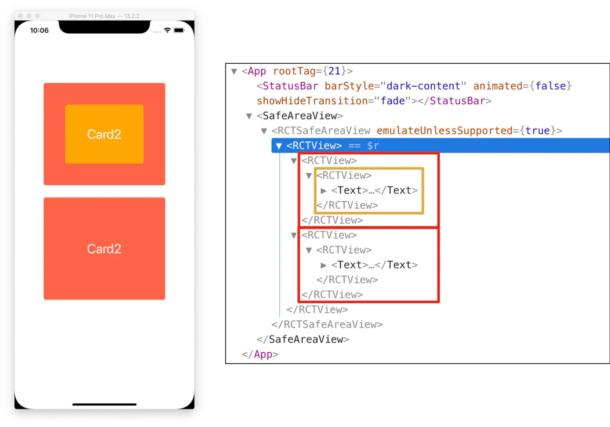

从上图中可以看出，React 组件和代码写的结构还是一一对应的。

我们再看看 React Native 渲染到原生视图后的嵌套层级（iOS 用 Debug View Hierarchay，Android 用 Layout Inspector）：

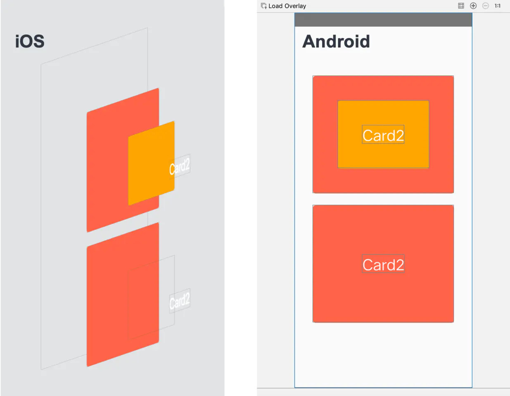

从上图可以看出，iOS 是一个 React 节点对应一个原生 View 节点的；
Android 第二个卡片的空白 View 却不见了.
如果我们翻一翻 React Native 的源码，就会发现 React Native Android UI 布局前，会对只有布局属性的 View（[LAYOUT_ONLY_PROPS 源码](https://github.com/facebook/react-native/blob/c2c4b43dfe098342a6958a20f6a1d841f7526e48/ReactAndroid/src/main/java/com/facebook/react/uimanager/ViewProps.java#L185)）进行过滤，这样可以减少 View 节点和嵌套，对碎片化的 Android 更加友好。

通过这个小小的例子我们可以看出，React 组件映射到原生 View 时，并不是一一对应的.

## 2.4. 使用 React.Fragment 避免多层嵌套
避免多写一层 View,减少不必要的View的渲染.

## 2.5. 减少 GPU 过度绘制
我们在业务开发时，经常会遇到这种场景：整个界面的背景色是白色的，上面又加了一个白色背景的卡片组件，卡片内部又包含了一个白色背景的小组件......

首先我们要明确一点，屏幕上的每个像素点的颜色，是由多个图层的颜色决定的，GPU 会渲染这些图层混合后的最终颜色，但是，iOS 和 Android 的 GPU 渲染机制是不一致的。

我们用 iOS 的 Color Blended Layers 和 Android 的GPU [过度绘制调试工具](https://developer.android.com/studio/profile/inspect-gpu-rendering#debug_overdraw)查看最后的渲染结果：

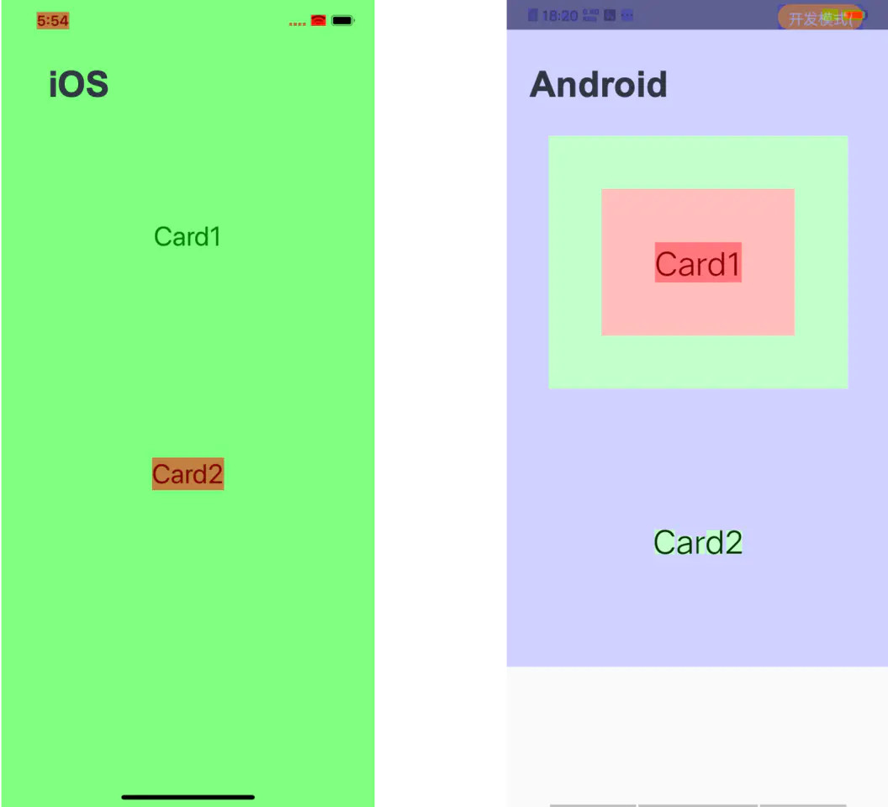

对于 iOS 来说，出现红色区域，就说明出现了颜色混合：
* Card1 的几个 View 都设置了非透明背景色，GPU 获取到顶层的颜色后，就不再计算下层的颜色了
* Card2 的 Text View 背景色是透明的，所以 GPU 还要获取下一层的颜色进行混合

对于 Android 来说，GPU 会多此一举地渲染对用户不可见的像素。有一个颜色指示条：`白 -> 蓝 -> 绿 -> 粉 -> 红`，颜色越往后表示过度绘制越严重。
* Card1 的几个 View 都设置了非透明背景色，红色表示起码发生了 4 次过度绘制
* Card2 只有文字发生了过度绘制

在过渡绘制这个测试上，iOS 和 Android 的实验结果几乎是完全相反的，所以解决方案肯定不是两全其美的，我个人认为，React Native 开发做视图优化时，应该优先优化 Android，所以我们可以从以下几点优化：
1. 减少背景色的重复设置：每个 View 都设置背景色的话，在 Android 上会造成非常严重的过度绘制；并且只有布局属性时，React Native 还会减少 Android 的布局嵌套
2. 避免设置半透明颜色：半透明色区域 iOS Android 都会引起过度绘制
3. 避免设置圆角：圆角部位 iOS Android 都会引起过度绘制
4. 避免设置阴影：阴影区域 iOS Android 都会引起过度绘制
......

避免 GPU 过度绘制的细节太多了，一般页面不需要这种精细化管理，长列表优化时可以考虑一下这个方向。

# 3. 图片优化那些事
性能优化的另一个大头就是图片。
这里的图片优化不仅仅指减少图片大小，减少 HTTP 带宽占用，我会更多的讨论一些 Image 组件上的优化，比如说缓存控制，图片采样等技术。

## 3.6. Image 组件的优化项
React Native 的 [Image](https://reactnative.dev/docs/image) 图片组件，如果只是作为普通的图片展示组件，那它该有的都有了，

比如说：
1. 加载本地/网络图片
2. 自动匹配 @2x/@3x 图片
3. 图片加载事件：onLoadStart/onLoad/onLoadEnd/onError
4. loading 默认图 or loading 指示器
......

但是，如果你要把它当一个图片下载管理库用时，就会非常的难受，因为 Image 的这几个属性在 iOS/Android 上有不同的表现，有的实现了有的没有实现，用起来非常不顺手。

在讲解图片优化前，我们先想一下，一个基本的图片下载管理库要实现什么：
* 图片类型：首先你的主要职责是加载图片，你起码能加载多种图片类型
* 下载管理：在加载多张图片的场景，能管理好多个请求，可以控制图片加载的优先级
* 缓存管理：做好三级缓存，不能每个图片都要请求网络，均衡好内存缓存和磁盘缓存的策略
* 多图加载：大量图片同时渲染时，如何让图片迅速加载，减少卡顿

针对上面的 4 条原则，我们来一一刨析 Image 组件。

### 3.6.3. 图片类型
基础的 `png/jpg/base64/gif` 格式，支持良好。不过要注意的是，想要 Android 加载的 gif 图片动起来，要在 build.gradle 里面加一些依赖，具体内容可以看这个 [链接](https://facebook.github.io/react-native/docs/image#gif-and-webp-support-on-android)。

如果要加载 webp 格式的图片，就有些问题了。作为 Google 推出的一种图片格式，Android 自然是支持的，但是 iOS 就不支持了，需要我们安装一些第三方插件。

### 3.6.4. 下载管理
先说结论，Image 组件对图片的下载管理能力基本为 0。

Image基本上只能监听单张图片的加载流程：`onLoadStart/onLoad/onLoadEnd/onError`，如果要控制多张图片的下载优先级，对不起，没有。

### 3.6.5. 缓存管理
缓存这里要从两方面说，
一是通过 HTTP 头信息管理缓存，
二是直接通过一些组件属性管理缓存。

Image 组件请求网络图片时，其实是可以加 HTTP header 头信息的，这样就可以利用 HTTP 缓存来管理图片，写法如下面代码所示：
```
<Image
  source={{
    uri: 'https://facebook.github.io/react/logo-og.png',
    method: 'POST',
    headers: {
      Pragma: 'no-cache',
    },
    body: 'Your Body goes here',
  }}
  style={{width: 400, height: 400}}
/>
```
具体的控制参数可以参考 [MDN HTTP](https://developer.mozilla.org/zh-CN/docs/Web/HTTP/Caching_FAQ) 缓存，这里就不细说了。

直接通过属性控制图片缓存，iOS 有。
iOS 可以通过 source 参数里的 cache 字段控制缓存，属性也是非常常见的那几种：`default(默认)/reload(不使用缓存)/force-cache(强缓存)/only-if-cached(只使用缓存)`。具体的使用可以看 [iOS Image](http://reactnative.dev/docs/images#cache-control-ios-only) 缓存文档。
```
<Image
  source={{
    uri: 'https://reactjs.org/logo-og.png',
    cache: 'only-if-cached'
  }}
  style={{ width: 400, height: 400 }}
/>
```

Android？对不起，没有。

### 3.6.6. 多图加载
都快到 5G 时代了，短视频/VLog 大家都天天刷了，更不用说多图场景了，基本上已经是互联网应用的标配了。

讲图片加载前先明确一个概念：`图片文件大小 != 图片加载到内存后的大小`。

我们常说的 jpg png webp，都是原图压缩后的文件，利于磁盘存储和网络传播，但是在屏幕上展示出来时，就要恢复为原始尺寸了。

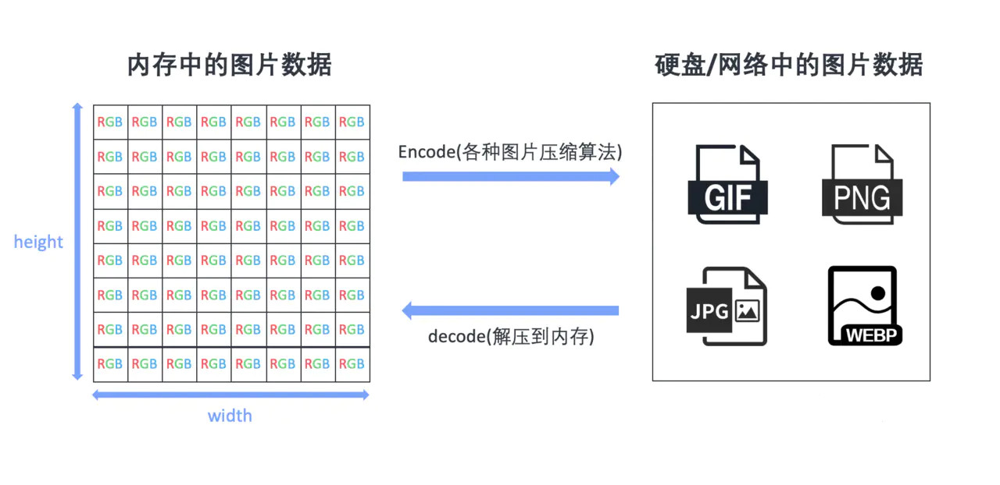

比如说一张 1024x768 的 png 图片，可能磁盘空间就十几 kb，不考虑分辨率等问题，加载到内存里，就要占用 3 Mb。
```js
// 不同的分辨率/文件夹/编码格式，都会带来数值差异
// 下面的计算只是最一般的场景，领会精神即可

(1024 * 768 * 4 * 8) / (8 * 1024 * 1024) = 3 MB
//(长 * 宽 * 每个像素占用字节数) / (8 * 1024 * 1024) = 3 MB
```
上面只是 1024x768 的图片，如果图片尺寸增加一倍，图片在内存里的大小是按平方倍数增长的，数量一多后，内存占用还是很恐怖的。

在多图加载的场景里，经过实践，iOS 不管怎么折腾，表现都比较好，但是 Android 就容易出幺蛾子。

下面我们就详细说说 Android 端如何优化图片。

在一些场景里，Android 会内存爆涨，帧率直接降为个位数。这种场景往往是小尺寸 Image 容器加载了特别大的图片，比如说 100x100 的容器加载 1000x1000 的图片，内存爆炸的原因就是上面说的原因。

那么这种问题怎么解决呢？
Image 有个 [resizeMethod](https://reactnative.dev/docs/image#resizemethod) 属性，就是解决 Android 图片内存暴涨的问题。当图片实际尺寸和容器样式尺寸不一致时，决定以怎样的策略来调整图片的尺寸。
* resize：小容器加载大图的场景就应该用这个属性。原理是在图片解码之前，会用算法对其在内存中的数据进行修改，一般图片大小大概会缩减为原图的 1/8。
* scale：不改变图片字节大小，通过缩放来修改图片宽高。因为有硬件加速，所以加载速度会更快一些。
* auto：文档上说是通过启发式算法自动切换 resize 和 scale 属性。这个启发式算法非常误导人，第一眼看上去还以为是会对比容器尺寸和图片尺寸采用不同策略。但我看了一下源码，它只是单纯的判断图片路径，如果是本地图片，就会用 resize，其他都是 scale 属性，所以 http 图片都是 scale 的，我们还得根据具体场景手动控制。

顺便提一下，Android 图片加载的时候，还会有一个 easy-in 的 300ms 加载动画效果，看上去会觉得图片加载变慢了，我们可以通过设置 fadeDuration 属性为 0，来关闭这个加载动画。

## 3.7. 优先使用 32 位色彩深度的图片
[色彩深度 wiki](https://zh.wikipedia.org/wiki/%E8%89%B2%E5%BD%A9%E6%B7%B1%E5%BA%A6)


色彩深度这个概念其实前面也提了一下，比如说我们常用的带透明度 PNG 图片，就是 32 位的：
```
R：红色，占据 8 bit
G：绿色，占据 8 bit
B：蓝色，占据 8 bit
A：透明通道，占据 8 bit
```
为啥推荐使用 32 bit 图片呢？
直接原因有 2 个：
* Android 推荐使用 [ARGB_8888](https://developer.android.com/reference/android/graphics/Bitmap.Config#ARGB_8888) 格式的图片，因为这种图片显示效果更好
* iOS GPU 只支持加载 32 bit 的图片。如果是其他格式的（比如说 24 bit 的 jpg），会先在 CPU 里转为 32 bit，再传给 GPU

虽然推荐 32 bit 图片，但是说实话，这个对前端开发是不可控的，因为图片来源一般就 2 个：
* 设计师的切图，由设计师控制
* 网络上的图片，由上传者控制

所以想针对这一点进行优化的话，沟通成本挺高，收益反而不高（一般只在长列表有些问题），但也是图片优化的一个思路，故放在这一节里。

## 3.8. Image 和 ImageView 长宽保持一致
前面举了一个 `100x100` 的 ImageView 加载 `1000x1000` Image 导致 Android 内存 OOM 的问题，我们提出了设置 `resizeMethod={'resize'}` 的方法来缩减图片在内存中的体积。
其实这是一种无奈之举，如果可以控制加载图片的大小，我们应该保持 Image 和 ImageView 长宽一致。

首先我们看看长宽不一致会引起的问题：
* Image 小于 ImageView：图片不清晰，表情包电子包浆质感
* Image 大于 ImageView：浪费内存，有可能会引起 OOM
* 尺寸不一致会带来抗锯齿计算，增加了图形处理负担

React Native 开发时，布局使用的单位是 pt，和 px 存在一个倍数关系。
在加载网络图片时，我们可以使用 React Native 的 [PixelRatio.getPixelSizeForLayoutSize](https://reactnative.dev/docs/pixelratio#getpixelsizeforlayoutsize) 方法，根据不同的分辨率加载不同尺寸的图片，保证 Image 和 ImageView 长宽一致。

## 3.9. 使用 react-native-fast-image
[react-native-fast-image](https://github.com/DylanVann/react-native-fast-image)

经过上面的几个 Image 属性分析，综合来看，Image 组件对图片的管理能力还是比较弱的，社区上有个 Image 组件的替代品：react-native-fast-image。

它的底层用的是 iOS 的 [SDWebImage](https://github.com/rs/SDWebImage)  和 Android 的 [Glide](https://github.com/bumptech/glide) 。这两个明星图片下载管理库，原生开发同学肯定很熟悉，在缓存管理，加载优先级和内存优化上都有不错的表现。而且这些属性都是双平台可用，这个库都封装好了，但是官网上只有基础功能的安装和配置，如果想引入一些功能（比如说支持 WebP），还是需要查看 SDWebImage 和 Glide 的文档的。

引入前我还是想提醒一下，React Native 的 Android Image 组件底层封装了 FaceBook 的 Fresco，引入这个库相当于又引入了 Glide，包体积不可避免的会变大，所以引入之前可能还要均衡一下。

## 3.10. 图片服务器辅助
前面说的都是从 React Native 侧优化图片，但是一个产品从来不是单打独斗，借助服务端的力量其实可以省很多事。

### 3.10.7. 使用 WebP
WebP 的优势不用我多说，同样的视觉效果，图片体积会明显减少。而且可以显著减小 CodePush 热更新包的体积（热更新包里，图片占用 90% 以上的体积）。

虽然 WebP 在前端解压耗时可能会多一点点，但是考虑到传输体积缩小会缩短网络下载时间，整体的收益还是不错的。

### 3.10.8. 图床定制图片
一般比较大的企业都有内建图床和 CDN 服务，会提供一些自定制图片的功能，比如说指定图片宽高，控制图片质量。当然一些比较优秀的第三方对象存储也提供这些功能，比如说[七牛云 图片处理](https://developer.qiniu.com/dora/api/1279/basic-processing-images-imageview2)。

借用云端图片定制功能，前端可以轻松通过控制 URL 参数控制图片属性。

比如说 Android 通过 resizeMethod 的 resize 更改图片字节大小，虽然也可以解决问题，但是这个算法还是在前端运行的，还是会占用用户内存资源。
我们把链接改成：
```
https://www.imagescloud.com/image.jpg/0/w/100/h/100/q/80
// w: 长为 100 px
// h: 宽最多为 100 px
// q: 压缩质量为 80
```
这样子就可以把计算转移到服务端，减少前端的 CPU 占用，优化前端整体的性能。


# 4. 对象创建调用分离
对象创建和调用分离，其实更多的是一种编码习惯。

我们知道在 JavaScript 里，啥都是对象，而在 JS 引擎里，创建一个对象的时间差不多是调用一个已存在对象的 10 多倍。在绝大部分情况下，这点儿性能消耗和时间消耗根本不值一提。但在这里还是要总结一下，因为这个思维习惯还是很重要的。

## 4.11. public class fields 语法绑定回调函数

作为一个前端应用，除了渲染界面，另一个重要的事情就是处理用户交互，监听各种事件。所以在组件上绑定各种处理事件也是一个优化点。

在 React 上如何处理事件已经是个非常经典的话题了，我搜索了一下，从 React 刚出来时就有这种文章了，动不动就是四五种处理方案，再加上新出的 Hooks，又能玩出更多花样了。

最常见的绑定方式应该是直接通过箭头函数处理事件：
```
class Button extends React.Component {
  handleClick() {
    console.log('this is:', this);
  }

  render() {
    return <button onClick={(e) => this.handleClick(e)}>Click me</button>;
  }
}
```
但这种语法的问题是每次 Button 组件重新渲染时，都会创建一个 handleClick() 函数，当 re-render 的次数比较多时，会对 JS 引擎造成一定的垃圾回收压力，会引起一定的性能问题。

[官方文档](https://zh-hans.reactjs.org/docs/handling-events.html)里比较推荐开发者使用 🔗 [public class fields 语法](https://babeljs.io/docs/en/babel-plugin-transform-class-properties/) 来处理回调函数，这样的话一个函数只会创建一次，组件 re-render 时不会再次创建：
```
class Button extends React.Component {
  // 此语法确保 handleClick 内的 this 已被绑定。
  handleClick = () => {
    console.log('this is:', this);
  }

  render() {
    return <button onClick={this.handleClick}>Click me</button>;
  }
}
```
在实际开发中，经过一些数据对比，因绑定事件方式的不同引起的性能消耗基本上是可以忽略不计的，re-render 次数过多才是性能杀手。但我认为这个意识还是有的，毕竟从逻辑上来讲，re-render 一次就要创建一个新的函数是真的没必要。

## 4.12. public class fields 语法绑定渲染函数
这个其实和第一个差不多，只不过把事件回调函数改成渲染函数，在 React Native 的 Flatlist 中很常见。
使用 [Flatlist](https://reactnative.dev/docs/flatlist) 时直接向 renderItem 传入匿名函数，这样每次调用 render 函数时都会创建新的匿名函数：
```
render(){
  <FlatList
    data={items}
    renderItem={({ item }) => <Text>{item.title}</Text>}
  />
}
```
改成 public class fields 式的函数时，就可以避免这个现象了：
```
renderItem = ({ item }) => <Text>{item.title}</Text>;

render(){
  <FlatList
    data={items}
    renderItem={renderItem}
  />
}
```
同样的道理，ListHeaderComponent 和 ListFooterComponent 也应该用这样写法，预先传入已经渲染好的 Element，避免 re-render 时重新生成渲染函数，造成组件内部图片重新加载出现的闪烁现象。

## 4.13. StyleSheet.create 替代 StyleSheet.flatten
[StyleSheet](https://reactnative.dev/docs/stylesheet)

StyleSheet.create 这个函数，会把传入的 Object 转为优化后的 StyleID，在内存占用和 Bridge 通信上会有些优化。
```
const styles = StyleSheet.create({
  item: {
    color: 'white',
  },
});
console.log(styles.item) // 打印出的是一个整数 ID
```
在业务开发时，我们经常会抽出一些公用 UI 组件，然后传入不同的参数，让 UI 组件展示不一样的样式。

为了 UI 样式的灵活性，我们一般会使用 StyleSheet.flatten，把通过 props 传入自定义样式和默认样式合并为一个样式对象：
```
const styles = StyleSheet.create({
  item: {
    color: 'white',
  },
});

StyleSheet.flatten([styles.item, props.style]) // <= 合并默认样式和自定义样式
```
这样做的好处就是可以灵活的控制样式，问题就是使用这个方法时，会 [递归遍历](https://github.com/facebook/react-native/blob/aee88b6843/Libraries/StyleSheet/flattenStyle.js) 已经转换为 StyleID 的样式对象，然后生成一个新的样式对象。这样就会破坏 StyleSheet.create 之前的优化，可能会引起一定的性能负担。

当然本节不是说不能用 StyleSheet.flatten，通用性和高性能不能同时兼得，根据不同的业务场景采取不同的方案才是正解。

## 4.14. 避免在 render 函数里创建新数组/对象
我们写代码时，为了避免传入 `[]` 的地方因数据没拿到传入 `undefined`，经常会默认传入一个空数组：
```
render() {
  return <ListComponent listData={this.props.list || []}/>
}
```
其实更好的做法是下面这样的：
```
const EMPTY_ARRAY = [];

render() {
    return <ListComponent listData={this.props.list || EMPTY_ARRAY}/>
}
```
这个其实算不上啥性能优化，还是前面再三强调的思路：对象创建和调用分离。毕竟每次渲染的时候减少重新创建一个空的数组/对象，能带来的性能问题提升微乎其微.
把 `[]` 改为统一的 `EMPTY_ARRAY` 常量，其实和日常编码中避免出现 Magic Number 一样，算一种编程习惯，但我觉得这种优化可以归到这个类别里，所以专门提一下。

# 5. 动画性能优化
动画流畅很简单，在大部分的设备上，只要保证 60fps 的帧率就可以了。但要达到这个目标，在 React Native 上还是有些问题的，有一张图，描述了目前 React Native 的基础架构（0.61 版本）。
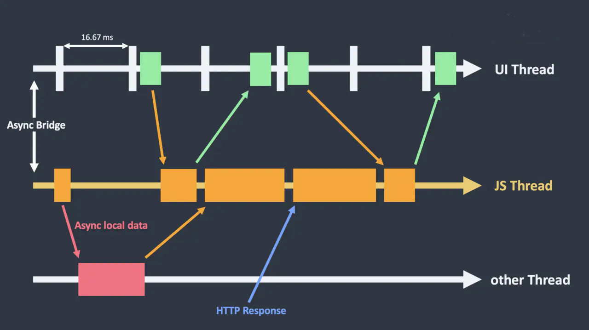

* UI Thread：在 iOS/Android 上专门绘制 UI 的线程
* JS Thread：我们写的业务代码基本都在这个线程上，React 重绘，处理 HTTP 请求的结果，磁盘数据 IO 等等
* other Thread：泛指其他线程，比如说数据请求线程，磁盘 IO 线程等等

上图我们可以很容易的看出，JS 线程太忙了，要做的事情太多了。而且 UI Thread 和 JS Thread 之前通信是异步的（Async Bridge），只要其它任务一多，就很难保证每一帧都是及时渲染的。

分析清楚了，React Native 动画优化的方向自然而然就出来了：
* 减少 JS Thread 和 UI Thread 之间的异步通信
* 尽量减少 JS Thread 侧的计算

## 5.15. 开启 useNativeDrive: true
JS Thread 和 UI Thread 之间是通过 JSON 字符串传递消息的。对于一些可预测的动画，比如说点击一个点赞按钮，就跳出一个点赞动画，这种行为完全可以预测的动画，我们可以使用 useNativeDrive: true 开启原生动画驱动。

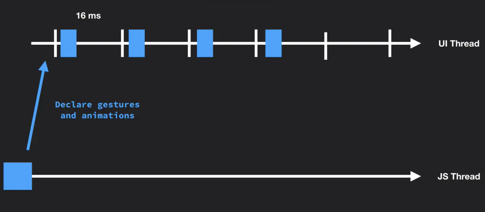

通过启用原生驱动，我们在启动动画前就把其所有配置信息都发送到原生端，利用原生代码在 UI 线程执行动画，而不用每一帧都在两端间来回沟通。如此一来，动画一开始就完全脱离了 JS 线程，因此此时即便 JS 线程被卡住，也不会影响到动画了。

使用也很简单，只要在动画开始前在动画配置中加入 `useNativeDrive: true` 就可以了：

[Using the native driver](https://reactnative.dev/docs/animations#using-the-native-driver)

```
Animated.timing(this.state.animatedValue, {
  toValue: 1,
  duration: 500,
  useNativeDriver: true // <-- 加上这一行
}).start();
```
开启后所有的动画都会在 Native 线程运行，动画就会变的非常丝滑顺畅。

经过各种暴力测试，使用原生驱动动画时，基本没有掉帧现象，但是用  JS 驱动动画，一旦操作速度加快，就会有掉帧现象。

值得注意的是，useNativeDriver 这个属性也有着局限性，只能使用到只有非布局相关的动画属性上，例如 transform 和 opacity。布局相关的属性，比如说 height 和 position 相关的属性，开启后会报错。而且前面也说了，useNativeDriver 只能用在可预测的动画上，比如说跟随手势这种动画，useNativeDriver 就用不了的。

## 5.16. 使用 setNativeProps
[setNativeProps](https://reactnative.dev/docs/direct-manipulation) 这个属性，相当于直接操作浏览器的 DOM。React 官方一般是不推荐直接操作 DOM 的，但业务场景千变万化，总会遇到一些场景不得不操作 DOM，在React Native 里也是同样的道理。

比如说下面的动图，在屏幕中上下滚动时，y 轴上的偏移可以通过 ScrollView#onScroll 属性开启 useNativeDrive: true 来优化滚动体验。但是我们可以看到，随着上下滑动，圆圈里的数字也是随之变化的。


如果把数字存在 this.state 里， 每次滑动不可避免的要进行大量的 setState，React 端会进行大量的重绘操作，可能会引起掉帧。我们这里就可以用 setNativeProps，避免 React 端重绘，相当于直接修改 DOM 上的数字，这样可以让动画更加流畅。

## 5.17. 使用 LayoutAnimation
针对一次性动画，建议使用 LayoutAnimation，也是原生动画驱动.
但LayoutAnimation仅适用于抛弃式(fire-and-forget)动画（“静态”动画）-如果必须可中断，则需要使用Animated。

## 5.18. 使用 InteractionManager
原生应用感觉如此流畅的一个重要原因就是在互动和动画的过程中避免繁重的操作。

在 React Native 里，JS 线程太忙了，啥都要干，我们可以把一些繁重的任务放在 [InteractionManager.runAfterInteractions()](https://reactnative.dev/docs/interactionmanager) 里，确保在执行前所有的交互和动画都已经处理完毕。
```
InteractionManager.runAfterInteractions(() => {
  // ...需要长时间同步执行的任务...如页面转场
});
```
在 React Native 官方提供的组件里，PanResponder、Animated，VirtualizedList 都用了 InteractionManager，为的就是平衡复杂任务和交互动画之间的执行时机。

注意点:
如果执行了一个无限循环的动画（loading 效果），并且没有关闭，所以就永远进不到 runAfterInteractions 的回调了。所以在开发中碰到循环动画要注意处理。

## 5.19. requestAnimationFrame：
有时候如果在调整响应触摸的组件的不透明度或高光的同一帧中执行操作，则直到onPress函数返回后我们才能看到动画效果。如果onPress里进行setState导致大量逻辑执行而丢了几帧，就可能会发生这种情况。
```
handleOnPress() {
  requestAnimationFrame(() => {
    this.doExpensiveAction();
  });
}
```

## 5.20. 优化View
View在屏幕上移动视图（滚动，平移，旋转）时如果出现丢帧的情况,可以启用 [shouldRasterizeIOS 或 renderToHardwareTextureAndroid](https://reactnative.dev/docs/view#rendertohardwaretextureandroid) . 当结束操作时应当将其关闭.

## 5.21. 使用 react-native-reanimated 和 react-native-gesture-handler

[视频教程](https://www.youtube.com/channel/UC806fwFWpiLQV5y-qifzHnA)

[react-native-gesture-handler](https://github.com/software-mansion/react-native-gesture-handler)

[react-native-reanimated](https://github.com/software-mansion/react-native-reanimated)

这两个库是被 Youtube 一个自由软件开发者博主 [ William Candillon](https://www.youtube.com/channel/UC806fwFWpiLQV5y-qifzHnA) 安利的，后面查了一下，也是 Expo 默认内置动画库和手势库。

这两个库目的就是替代 React Native 官方提供的 [手势库](https://reactnative.dev/docs/gesture-responder-system) 和  [动画库](https://reactnative.dev/docs/animated) ，除了 API 更加友好，我认为最大的优势是：手势动画是在 UI Thread 运行的。

我们在前面也说了，`useNativeDrive: true` 这个属性，只能用在可预测的动画上。跟随手势的动画，是无法使用这个属性的，所以手势捕捉和动画，都是在 JS 侧动态计算的。

举一个简单的例子：小球跟随手势移动。

我们先看看 React Native 官方提供的手势动画，可以看到 JS Thread 有大量的计算，计算结果再异步传输到 UI Thread，稍微有些风吹草动，就会引起掉帧。

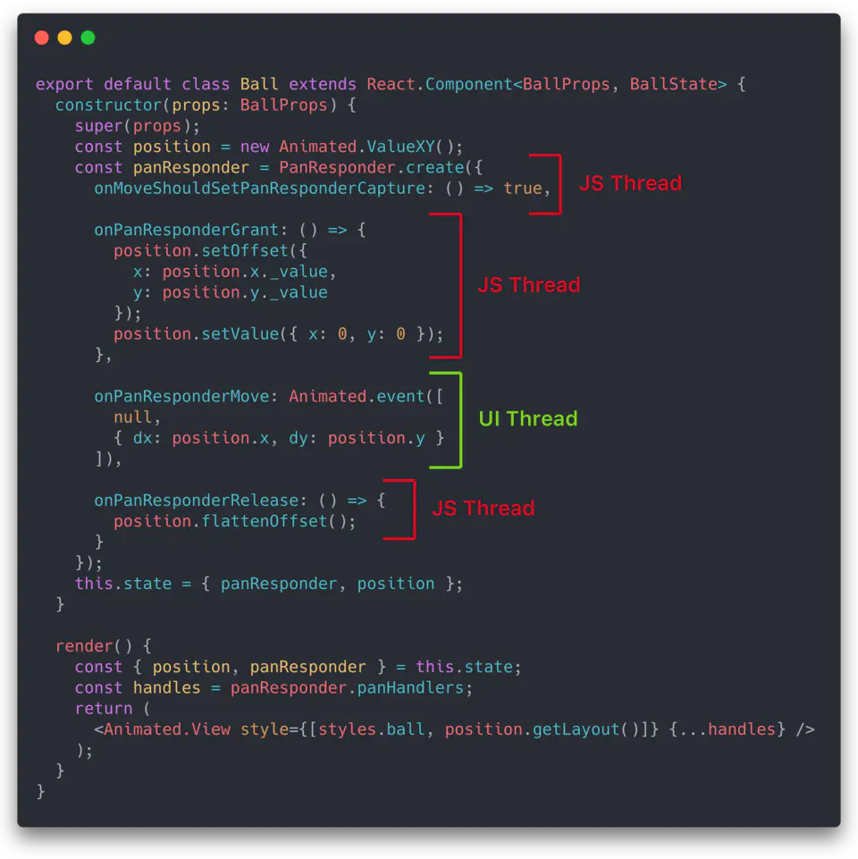

如果使用 react-native-gesture-handler，手势捕捉和动画都是 UI Thread 进行的，脱离 JS Thread 计算和异步线程通信，流畅度自然大大提升：

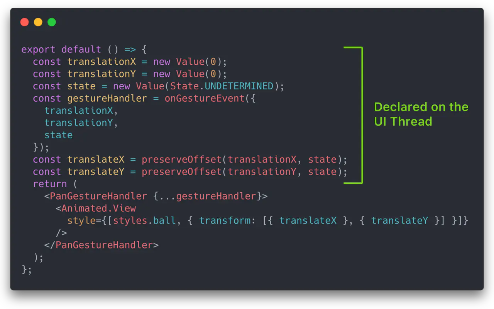

所以说，如果要用 React Native 构建复杂的手势动画，使用 react-native-gesture-handler 和 react-native-reanimated，是一个不错的选择，可以大幅度提高动画的流畅度。

## 5.22. 使用 BindingX
[BindingX](https://alibaba.github.io/bindingx/guide/cn_introduce) 是阿里开源的一个框架，用来解决 weex和 React Native上富交互问题，核心思路是将"交互行为"以表达式的方式描述，并提前预置到 Native，避免在行为触发时 JS 与 Native 的频繁通信。

当然，引入上面几个第三方库会肯定会带来一定的学习成本。对于复杂交互的页面，有的团队可能会采用原生组件来代替，比如说 [美团外卖](https://mp.weixin.qq.com/s/9wv4uHg51EELU0yoIFQw8A)
就会用原生组件去实现精细动画和强交互模块，所以具体使用还要看团队的技术储备和 APP 场景。

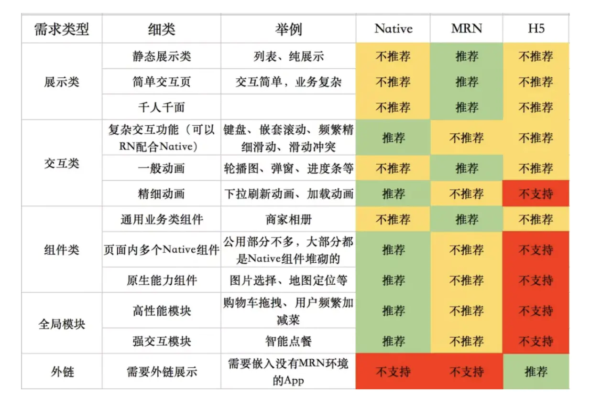

# 6. 长列表性能优化
在 React Native 开发中，最容易遇到的对性能有一定要求场景就是长列表了。在日常业务实践中，优化做好后，千条数据渲染还是没啥问题的。

虚拟列表前端一直是个经典的话题，核心思想也很简单：只渲染当前展示和即将展示的 View，距离远的 View 用空白 View 展示，从而减少长列表的内存占用。

在 React Native 官网上，[列表配置优化](https://reactnative.dev/docs/optimizing-flatlist-configuration#docsNav) 其实说的很好了，我们基本上只要了解清楚几个配置项，然后灵活配置就好。但是问题就出在「了解清楚」这四个字上。

## 6.23. 各种列表间的关系
React Native 有好几个列表组件，先简单介绍一下：
* ScrollView：会把视图里的所有 View 渲染，直接对接 Native 的滚动列表
* VirtualizedList：虚拟列表核心文件，使用 ScrollView，长列表优化配置项主要是控制它
* FlatList：使用 VirtualizedList，实现了一行多列的功能，大部分功能都是 VirtualizedList 提供的
* SectionList：使用 VirtualizedList，底层使用 VirtualizedSectionList，把二维数据转为一维数据

还有一些其他依赖文件

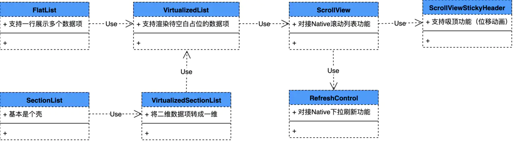

我们可以看出 VirtualizedList 才是主演

## 6.24. 列表配置项
先写个小 demo。demo 非常简单，一个基于 FlatList 的奇偶行颜色不同的列表。
```
export default class App extends React.Component {
  renderItem = item => {
    return (
      <Text
        style={{
            backgroundColor: item.index % 2 === 0 ? 'green' : 'blue',
        }}>
        {'第 ' + (item.index + 1) + ' 个'}
      </Text>
    );
  }

  render() {
    let data = [];
    for (let i = 0; i < 1000; i++) {
        data.push({key: i});
    }

    return (
      <View style={{flex: 1}}>
        <FlatList
            data={data}
            renderItem={this.renderItem}
            initialNumToRender={3} // 首批渲染的元素数量
            windowSize={3} // 渲染区域高度
            removeClippedSubviews={Platform.OS === 'android'} // 是否裁剪子视图
            maxToRenderPerBatch={10} // 增量渲染最大数量
            updateCellsBatchingPeriod={50} // 增量渲染时间间隔
            debug // 开启 debug 模式
        />
      </View>
    );
  }
}
```
VirtualizedList 有个 debug 的配置项，开启后会在视图右侧显示虚拟列表的显示情况。

这个属性文档中没有说， [源码](https://github.com/facebook/react-native/blob/master/Libraries/Lists/VirtualizedList.js#L90) 里有，开启它后用来演示讲解还是很方便的，可以很直观的学习 initialNumToRender、windowSize、Viewport，Blank areas 等概念。

下面是开启 debug 后的 demo 截屏：

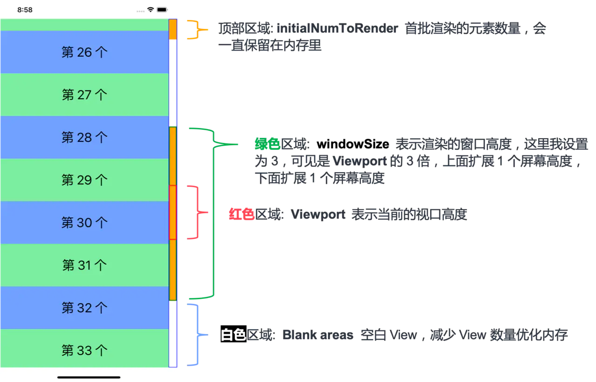

上面的图还是很清晰的，右侧 debug 指示条的黄色部分表示内存中 Item，各个属性我们再用文字描述一下：

### 6.24.9. initialNumToRender
首批应该渲染的元素数量，刚刚盖住首屏最好。而且从 debug 指示条可以看出，这批元素会一直存在于内存中。

### 6.24.10. Viewport
视口高度，就是用户能看到内容，一般就是设备高度。

### 6.24.11. windowSize
渲染区域高度，一般为 Viewport 的整数倍。这里我设置为 3，从 debug 指示条可以看出，它的高度是 Viewport 的 3 倍，上面扩展 1 个屏幕高度，下面扩展 1 个屏幕高度。在这个区域里的内容都会保存在内存里。
将 windowSize 设置为一个较小值，能有减小内存消耗并提高性能，但是快速滚动列表时，遇到未渲染的内容的几率会增大，会看到占位的白色 View。大家可以把 windowSize 设为 1 测试一下，100% 会看到占位 View。

### 6.24.12. Blank areas
空白 View，VirtualizedList 会把渲染区域外的 Item 替换为一个空白 View，用来减少长列表的内存占用。顶部和底部都可以有。

上图是渲染图，我们可以利用 react-devtools 再看看 React 的 Virtual DOM（为了截屏方便，我把 initialNumToRender 和 windowSize 设为 1），可以看出和上面的示意图是一致的。

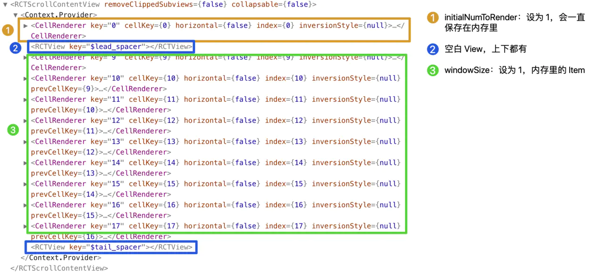

### 6.24.13. removeClippedSubviews
这个翻译过来叫「裁剪子视图」的属性，文档描述不是很清晰，大意是设为 true 可以提高渲染速度，但是 iOS 上可能会出现 bug。这个属性 VirtualizedList 没有做任何优化，是直接透传给 ScrollView 的。

在 0.59 版本的一次 [commit](https://github.com/facebook/react-native/commit/1a499f4) 里，FlatList 默认 Android 开启此功能，如果版本低于 0.59，可以用以下方式开启：`removeClippedSubviews={Platform.OS === 'android'}`

### 6.24.14. maxToRenderPerBatch 和 updateCellsBatchingPeriod
VirtualizedList 的数据不是一下子全部渲染的，而是分批次渲染的。这两个属性就是控制增量渲染的。
这两个属性一般是配合着用的，maxToRenderPerBatch 表示每次增量渲染的最大数量，updateCellsBatchingPeriod 表示每次增量渲染的时间间隔。

我们可以调节这两个参数来平衡渲染速度和响应速度。但是，调参作为一门玄学，很难得出一个统一的「最佳实践」，一般直接用的系统默认值。

## 6.25. ListLtems 优化

[ListLtems 优化文档](https://reactnative.dev/docs/optimizing-flatlist-configuration#list-items)

### 6.25.15. 使用 getItemLayout
如果 FlatList（VirtualizedList）的 ListLtem 高度是固定的，那么使用 getItemLayout 就非常的合算。

在源码中（[#L1287](https://github.com/facebook/react-native/blob/master/Libraries/Lists/VirtualizedList.js#L1287)、[#L2046](https://github.com/facebook/react-native/blob/master/Libraries/Lists/VirtualizedList.js#L2046)），如果不使用 getItemLayout，那么所有的 Cell 的高度，都要调用 View 的 onLayout 动态计算高度，这个运算是需要消耗时间的；如果我们使用了 getItemLayout，VirtualizedList 就直接知道了 Cell 的高度和偏移量，省去了计算，节省了这部分的开销。

使用 getItemLayout 注意点：
* 如果 ListItem 高度不固定，使用 getItemLayout 返回固定高度时，因为最终渲染高度和预测高度不一致，会出现页面跳动的问题【[问题链接](https://juejin.im/post/5b61479b6fb9a04f9963be77#heading-38)】
* 如果使用了 ItemSeparatorComponent，分隔线的尺寸也要考虑到 offset 的计算中【[文档链接](https://reactnative.dev/docs/flatlist#getitemlayout)】
* 如果 FlatList 使用的时候使用了 ListHeaderComponent，也要把 Header 的尺寸考虑到 offset 的计算中【[官方示例代码链接](https://github.com/facebook/react-native/blob/8553e1acc4195479190971cc7a3ffaa0ed37a5e0/RNTester/js/examples/MultiColumn/MultiColumnExample.js#L120)】

### 6.25.16. Use simple components & Use light components
使用简单组件，核心就是减少逻辑判断和嵌套，优化方式可以参考「二、减轻渲染压力」的内容。

### 6.25.17. Use shouldComponentUpdate
参考「一、re-render」的内容。

### 6.25.18. Use cached optimized images
参考「三、图片优化」的内容。

### 6.25.19. Use keyExtractor or key
常规优化点了，可以看 React 的文档 [列表&Key](https://zh-hans.reactjs.org/docs/lists-and-keys.html)。

### 6.25.20. Avoid anonymous function on renderItem
renderItem 避免使用匿名函数，参考「四、对象创建调用分离」的内容。

# 7. 开发模式
开发模式下运行（`dev=true`）性能会稍低一点

# 8. 去除console.log
console.log可能会在JavaScript线程中造成很大的瓶颈,可以使用[babel-plugin-transform-remove-console](https://babeljs.io/docs/en/babel-plugin-transform-remove-console/)将打包代码里的console.log去除掉.

# 9. RAM包 和 Inline Requires


## 9.26. RAM
[启用RAM格式](https://reactnative.dev/docs/ram-bundles-inline-requires#enable-the-ram-format)


在react-native可以执行JS代码之前，必须将该代码加载到内存中并进行解析。对于标准捆绑包，如果加载了50mb捆绑包，则必须先加载并解析所有50mb，然后才能执行任何捆绑包。

Random Access Modules(随机访问模块)（RAM）包格式背后的优化是，只能加载启动时实际需要的50mb部分，并根据需要逐步加载更多的软件包。

当require遇到尚未加载的模块时，它需要通过bridge发送消息。
可以通过[配置](https://reactnative.dev/docs/ram-bundles-inline-requires#investigating-the-loaded-modules)的方式进行bundle预加载.


## 9.27. Inline Requires
懒加载(内联加载)延迟对模块或文件的需求，直到实际需要该文件或文件为止。

即使没有RAM格式，内联加载也可能帮助启动时间缩短，因为VeryExpensive.js中的代码仅在第一次需要时才执行。

VeryExpensive.js
```
import React, { Component } from 'react';
import { Text } from 'react-native';
// ... import some very expensive modules

// You may want to log at the file level to verify when this is happening
console.log('VeryExpensive component loaded');

export default class VeryExpensive extends Component {
  // lots and lots of code
  render() {
    return <Text>Very Expensive Component</Text>;
  }
}
```
Optimized.js
```
import React, { Component } from 'react';
import { TouchableOpacity, View, Text } from 'react-native';

let VeryExpensive = null;

export default class Optimized extends Component {
  state = { needsExpensive: false };

  didPress = () => {
    if (VeryExpensive == null) {
      VeryExpensive = require('./VeryExpensive').default;
    }

    this.setState(() => ({
      needsExpensive: true
    }));
  };

  render() {
    return (
      <View style={{ marginTop: 20 }}>
        <TouchableOpacity onPress={this.didPress}>
          <Text>Load</Text>
        </TouchableOpacity>
        {this.state.needsExpensive ? <VeryExpensive /> : null}
      </View>
    );
  }
}
```


# 10. React Native 性能优化用到的工具
性能优化工具，本质上还是调试工具的一个子集。React Native 因为它的特殊性，做一些性能分析和调试时，需要用到 RN/iOS/Android 三端的工具，下面我就列举一下平常用得到的工具，具体的使用方法不是本文的重点，如有需要可根据关键词自行搜索。

## 10.28. React-Native-Debugger 
[React-Native-Debugger](https://github.com/jhen0409/react-native-debugger
)是在官方 Remote Debugger 调试工具的基础上，集成了 React Inspector 以及 Redux DevTools 的调试工具。

## 10.29. React Native 官方调试工具
[官方调试工具](https://reactnative.dev/docs/debugging#docsNav)。
切换`Show Perf Monitor`可以查看JS帧率（JavaScript线程）和UI帧率（native线程）

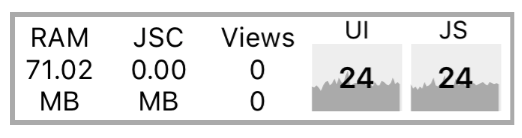

UI 和 JS 的帧数都稳定保持在60 为最优情况。

## 10.30. react-devtools
React Native 是跑在原生 APP 上的，布局查看不能用浏览器插件，所以要用这个基于 Electron 的 react-devtools。具体安装方法可见这个 [链接](https://zh-hans.reactjs.org/blog/2019/08/15/new-react-devtools.html)。

## 10.31. XCode
iOS 开发 IDE，查看分析性能问题时可以用 instruments 和 Profiler 进行调试。

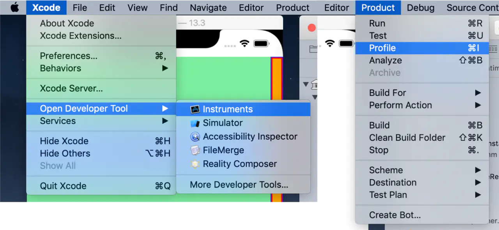

## 10.32. Android Studio
Android 开发 IDE，查看性能的话可以使用 Android Profiler， [官方网站](https://developer.android.com/studio/profile?hl=zh-cn) 写的非常详细。

## 10.33. iOS Simulator
iOS 模拟器，它的 Debug 可以看一些分析内容。

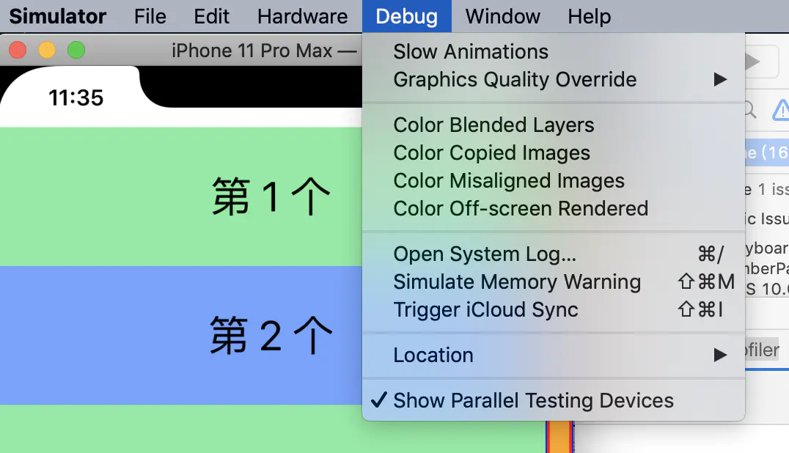

## 10.34. Android 真机 -> 开发者选项
Android 开发者选项有不少东西可看，比如说 GPU 渲染分析和动画调试。真机调试时可以开启配合使用。

## 10.35. bundle大小可视化
[react-native-bundle-visualizer](https://github.com/IjzerenHein/react-native-bundle-visualizer)


# 11. trick
## 11.36. 优化闪屏逻辑
由于大部分 APP 一定是先有闪屏，然后才进入首页。我们完全可以利用这个业务场景，让 RN 程序躲在闪屏下加载，直到加载完毕，通过 Bridge 通知客户端把闪屏关闭，这样就比较巧妙地解决了白屏的问题。

## 11.37. 逐层渲染
time slice分片渲染.


# 12. 参考
[Performance Overview](https://reactnative.dev/docs/performance)

[measuring-performance](https://medium.com/@vvvsejvvv/measuring-performance-reliably-in-react-native-is-easier-than-you-think-d7cc3d8df061)

[optimizing](https://blog.usejournal.com/getting-started-optimizing-a-react-native-app-1d7507c2d849)


