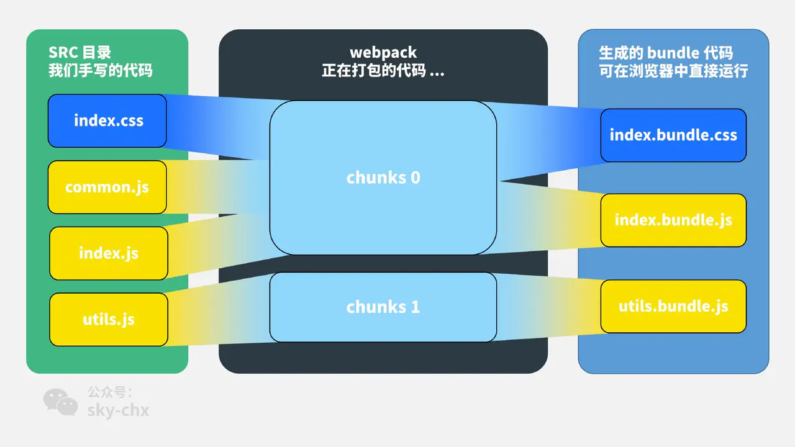
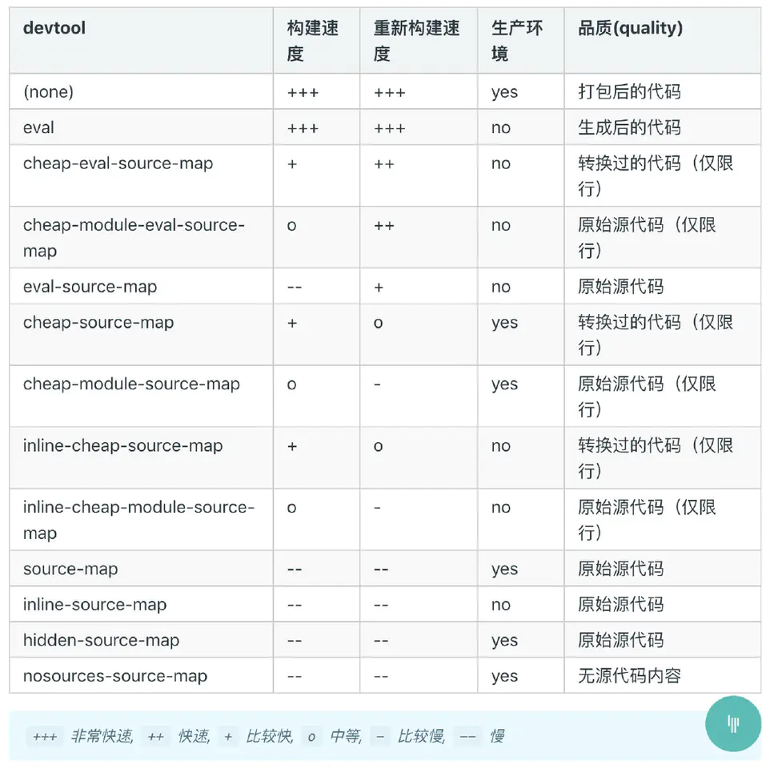

[webpack概念术语](https://webpack.docschina.org/glossary)

# module，chunk 和 bundle 的区别



看这个图就很明白了：

对于一份同逻辑的代码，当我们手写下一个一个的文件，它们无论是 ESM 还是 commonJS 或是 AMD，他们都是 module ；

当我们写的 module 源文件传到 webpack 进行打包时，webpack 会根据文件引用关系生成 chunk 文件，webpack 会对这个 chunk 文件进行一些操作；

webpack 处理好 chunk 文件后，最后会输出 bundle 文件，这个 bundle 文件包含了经过加载和编译的最终源文件，所以它可以直接在浏览器中运行。

一般来说一个 chunk 对应一个 bundle，比如上图中的 `utils.js -> chunks 1 -> utils.bundle.js`；

但也有例外，比如说上图中，我就用 MiniCssExtractPlugin 从 `chunks 0` 中抽离出了 `index.bundle.css` 文件。


# filename 和 chunkFilename 的区别

filename 是一个很常见的配置，就是对应于 entry 里面的输入文件，经过webpack 打包后输出文件的文件名。

chunkFilename 指未被列在 entry 中，却又需要被打包出来的 chunk 文件的名称。一般来说，这个 chunk 文件指的就是要懒加载的代码。

# webpackPrefetch、webpackPreload 和 webpackChunkName 
这几个名词其实都是 webpack[ 魔法注释（magic comments）](https://webpack.docschina.org/api/module-methods/#magic-comments)里的，文档中说了 6 个配置，配置都可以组合起来用。

## webpackChunkName
以在 import 文件时，在 import 里以注释的形式为 chunk 文件取别名：
```
async function getAsyncComponent() {
    var element = document.createElement('div');
  
    // 在 import 的括号里 加注释 /* webpackChunkName: "lodash" */ ，为引入的文件取别名
    const { default: _ } = await import(/* webpackChunkName: "lodash" */ 'lodash');

    element.innerHTML = _.join(['Hello!', 'dynamic', 'imports', 'async'], ' ');

    return element;
}
```
会生成`vendors~lodash.bundle.js `,`vendors~`是因为 webpack 懒加载是用内置的一个插件  [SplitChunksPlugin](https://webpack.docschina.org/plugins/split-chunks-plugin) 实现的，这个插件里面有些默认配置项，比如说 [automaticNameDelimiter](https://webpack.docschina.org/plugins/split-chunks-plugin/#optimization-splitchunks) ，默认的分割符就是 `~`，所以最后的文件名才会出现这个符号.


## webpackPrefetch 和 webpackPreload
这两个配置一个叫预拉取（Prefetch），
一个叫预加载（Preload）

如果我们 import 的时候添加 webpackPrefetch：
```
...

const { default: _ } = await import(/* webpackChunkName: "lodash" */ /* webpackPrefetch: true */ 'lodash');

...
```
就会以 `<link rel="prefetch" as="script">` 的形式预拉取 lodash 代码.

这个异步加载的代码不需要手动点击 button 触发，webpack 会在父 chunk 完成加载后，闲时加载 lodash 文件。

webpackPreload 是预加载当前导航下可能需要资源，他和 webpackPrefetch 的主要区别是：
* preload chunk 会在父 chunk 加载时，以并行方式开始加载。prefetch chunk 会在父 chunk 加载结束后开始加载。
* preload chunk 具有中等优先级，并立即下载。prefetch chunk 在浏览器闲置时下载。
* preload chunk 会在父 chunk 中立即请求，用于当下时刻。prefetch chunk 会用于未来的某个时刻


# hash、chunkhash、contenthash
hash受所有代码影响，只要有变化，hash就变了。

chunkhash，受到它自身chunk内容的影响，以及chunkId moduleId的影响。

contenthash,受到它自身文件内容的影响，以及chunkId moduleId的影响。

他们受影响的范围，依次递减。


# sourse-map 中 eval、cheap、inline 和 module

sourse-map ，里面都有个 map 了，肯定是映射的意思。sourse-map 就是一份源码和转换后代码的映射文件。



这 13 种大部分都是 eval、cheap、inline 和 module这 4 个词排列组合的

| 参数   | 参数解释                                                                |
| ------ | ----------------------------------------------------------------------- |
| eval   | 打包后的模块都使用 `eval()` 执行，行映射可能不准；不产生独立的 map 文件 |
| cheap  | map 映射只显示行不显示列，忽略源自 loader 的 source map                 |
| inline | 映射文件以 base64 格式编码，加在 bundle 文件最后，不产生独立的 map 文件 |
| module | 增加对 loader source map 和第三方模块的映射                             |


## source-map
source-map 是最大而全的，会生成独立 map 文件,source-map 会显示报错的行列信息.
可能会让 webpack 构建时间变长，看情况使用。

## cheap-sourse-map
cheap，就是廉价的意思，它不会产生列映射，相应的体积会小很多，和 sourse-map 打包的map文件结果比一下，只有原来的 1/4 。

## eval-source-map
eval-source-map 会以 `eval()` 函数打包运行模块，不产生独立的 map 文件，会显示报错的行列信息：

## inline-source-map
映射文件以 base64 格式编码，加在 bundle 文件最后，不产生独立的 map 文件。加入 map 文件后，可以明显的看到包体积变大；

## cheap-module-eval-source-map
一般是开发环境（dev）推荐使用，在构建速度报错提醒上做了比较好的均衡。

## cheap-module-source-map
一般来说，生产环境是不配 source-map 的，如果想捕捉线上的代码报错，可以用这个

