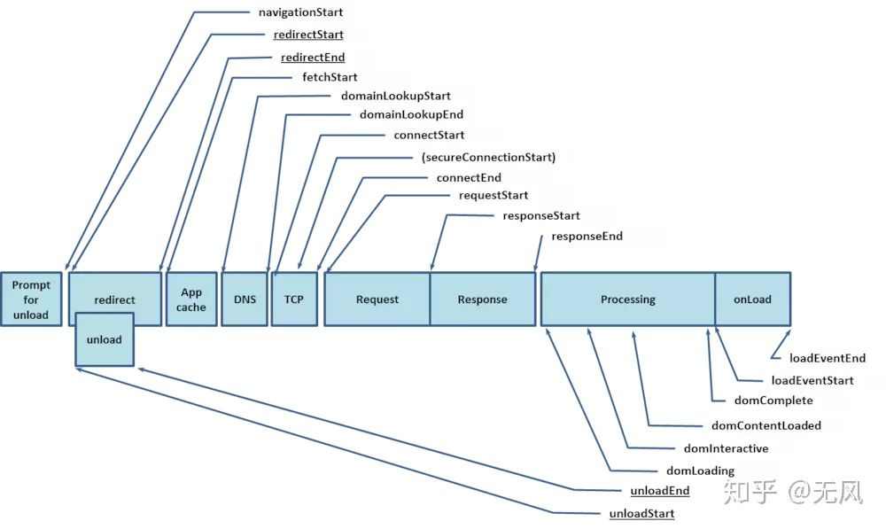
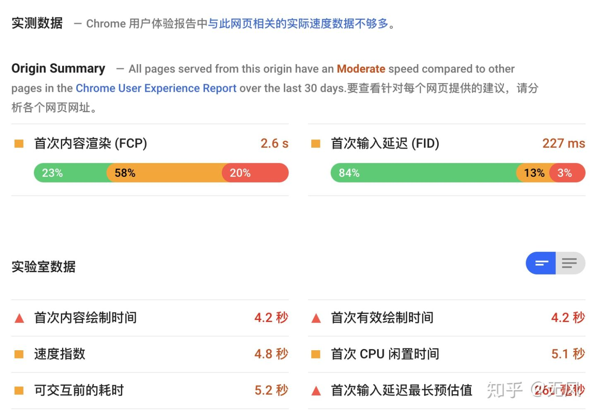

# 性能监控的主要意义
性能监控的主要意义有两个： 
* 改善用户体验 这方面，衍生出来的主要是客户端性能监控，说客户端不说页面主要是因为当前前端复杂的运行环境，比如说小程序，H5，pc端页面都是典型的运行环境。 一般来说，改善体验的循环是：`收集数据 -> 分析数据 -> 改代码 -> abtest -> 分析数据 -> 上线`，性能监控是在收集数据阶段起作用，分析数据当前阶段，绝大部分是后台系统加体验者人肉的方式。
* 监控系统异常 这方面，主要谈的的cgi(Common Gateway Interface公共网关接口?)的性能监控，监控内容主要是各个cgi的响应时间，主要也有两点左右，
  * 1、帮助优化接口性能，如果普遍响应很慢，就需要做一些优化措施了，
  * 2、帮助发现不可用错误，如果接口响应时间长的超过阈值，那说明可能接口挂掉了，这时候应该触发告警，让运维或者开发去查问题了。

# 主要指标
指标主要由三大块组成： 
* **系统获取** 系统部分主要指浏览器提供的一系列高精度的网页性能指标，一般来说常规使用如下图解析 performance 对象：

根据图中的各个时间戳的`end-start`，可以获得网页从加载到渲染各阶段的精确时间，从而评估网页在各阶段的性能。

* **监控系统定义** 各监控系统会自定义一些采集指标，同时在前端的js-sdk里面进行一些采集和统计 
  * 比如客户端维度的： cpu 使用率，fps监控，memory消耗等 
  * 比如业务维度的：
    * 首屏加载时间，通常使用`performance.timing`中的`domContentLoadedEventEnd - domContentLoadedEventStart` 
    * 页面停留时间，一般用 `unloadEventEnd - domContentLoadedEventEnd`来统计。

以上只是举例，各系统定义的指标还有很多，不同的监控目的对于指标的制定会有很多不一样的地方，也会导致很多实现方案上的差异。

* **自定义获取** 为了满足不同业务的需要，监控系统一般都会给各业务代码提供灵活的自定义接口，毕竟，通用接口是不能满足所有情况的。 和之前文章中提到的自定义上报方式类似，一般来说上报是由前端代码根据一定规则解析后上报，也可以上报到后端来解析，这儿就看各监控系统的实现和约定了

# 主要实现方式

* **performance对象** 这里其实很简单，就是根据`performance.timing`和图的指引，减减减就完事了。 这儿可以产生出很多标准数据，是监控系统的标配。
* **自定义模拟实现** 举个例子：监控系统提供标准api，收集key和value用于上报和展示自定义指标。 产品要求，只有展示出来首页的最后一张图才算完全加载完成。

考虑到这个实现，一般来说前端会自己打点，使用 `image.onload` 记录结束时间点，然后减去记录的`startTime`得到首页展示时间，根据{key, value}的格式上报后在后端查看。

这样的需求有很多，比如页面访问深度，页面停留时间，都可以通过自定义上报的方式来完成采集。

# 性能测试工具
接下来介绍一些性能测试工具，性能测试监控更多是事后的发现和处理，而上线前期需要一些工具对页面进行性能检测和验证 

## lighthouse
[Lighthouse](https://github.com/GoogleChrome/lighthouse) 是一个开源的自动化工具，用于改进网络应用的质量。(chrome 里的 audits就是) 

您可以将其作为一个 Chrome 扩展程序运行，或从命令行运行。 您为 Lighthouse 提供一个您要审查的网址，它将针对此页面运行一连串的测试，然后生成一个有关页面性能的报告。 google 官方出品，对项目进行全方位的体检。 特别好处是可以做上线前体检，通过npm安装后，可以直接通过本地执行命令的方式来获取页面报告，不过要注意一些细节带来的结果不准，比如页面登录和其他一些原因带来的网络延迟。 同时，lighthouse默认验证的是mobile，可能在pc端会有少许偏差

## pagespeed 
[pageSpeed](https://developers.google.com/speed) 老牌页面性能测试网站，听说底层是lighthouse，输入网址就能测试， 输出页面性能的各类指标，结果如下图 ：

pagespeed这儿有个问题，对国内的页面不友好，出不来结果，需要的话建议还是用lighthouse。

ps：早年的免费页面测试都收归到各大云厂商旗下去收钱了，说真的，还是本地测试靠谱。

